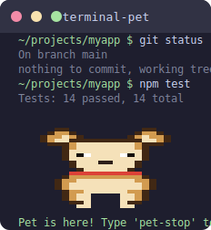

# Terminal Pet

A pixel art dog that lives at the bottom of your terminal while you work. It walks around, sleeps when idle, and reacts to your shell commands.



## Features

- Animated pixel art dog rendered with Unicode half-block characters
- Lives as an overlay at the bottom of your terminal — your shell stays fully usable
- Reacts to shell history: happy on `git commit`, scared on `rm -rf`, runs away on `shoo`
- Falls asleep after 30 seconds of inactivity, wakes up when you type
- State persists across sessions (saved to `~/.terminal_pet/state.json`)
- Auto-detects truecolor, 256-color, and 16-color terminals

## Install

```bash
pip install -e .
```

## Setup

### PowerShell

Add to your profile (`$PROFILE`):

```powershell
. ~/terminal-pet/pet.ps1
```

### Bash / Git Bash / Zsh

Add to your `~/.bashrc` or `~/.zshrc`:

```bash
source ~/terminal-pet/pet.sh
```

## Usage

```
pet              # Start the pet
pet -Reset       # Reset pet state (PowerShell)
pet --reset      # Reset pet state (Bash)
pet-stop         # Dismiss the pet
```

## How It Works

The `pet` command reserves the bottom 13 rows of your terminal using a scroll region, then starts a background Python process that animates the dog. Your shell continues normally in the upper portion. The animation writes directly to the terminal device (`/dev/tty` or `CONOUT$`) with cursor save/restore so it never interferes with your typing.

## Dog States

| State | Trigger | Behavior |
|-------|---------|----------|
| Idle | Default | Walks back and forth, blinks |
| Happy | `git commit`, `npm publish`, `pip install` | Bounces with tongue out |
| Scared | `rm -rf`, `DROP TABLE`, `git reset --hard` | Wide eyes, crouches |
| Running | `shoo`, `go away`, `scram` | Sprints offscreen, returns after a few seconds |
| Sleeping | 30s idle | Curls up with Zzz, wakes on any command |
| Dead | 2 hours with no interaction | Gravestone (reset with `pet --reset`) |

## Requirements

- Python 3.9+
- A terminal with ANSI/VT100 support (Windows Terminal, iTerm2, any modern terminal)
